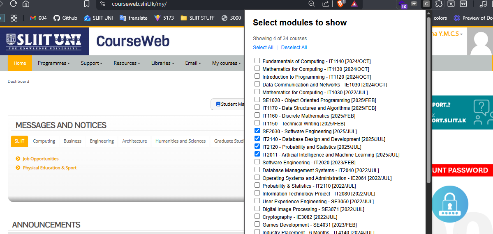

## Hide your unwanted modules on courseweb.sliit.lk

I accidentally clicked on some old modules on courseweb.sliit.lk and got self-enrolled in a lot of them. Now my “My Courses” dropdown menu is very long and hard to use.

To fix this, I built this Chrome extension. It helps me hide the modules I don’t want to see. now you can do that too!

---

### How to install

1. Download the latest release from the [Releases page](https://github.com/chamals3n4/hide-courseweb-modules/releases) and unzip it,  
   **or** clone this repo—that works too!
2. Open Chrome and go to `chrome://extensions`.
3. Turn on **Developer mode** (top right).
4. Click **Load unpacked** and select the folder with these files.
5. The default chrome extension icon will appear in your browser (it just shows the default icon for now, if you want to make a cool one, please send a PR )

---

### How to use

1. Click the extension icon in Chrome.
2. You will see a list of your modules. Tick the ones you want to keep.
3. Click **Apply Selection** on the bottom.
4. Refresh or revisit courseweb.sliit.lk. Only your selected modules will show in the "My Courses" dropdown.

To show all modules again, click **Show All** button in the popup.

### License

MIT — you can use or change this as you like.
